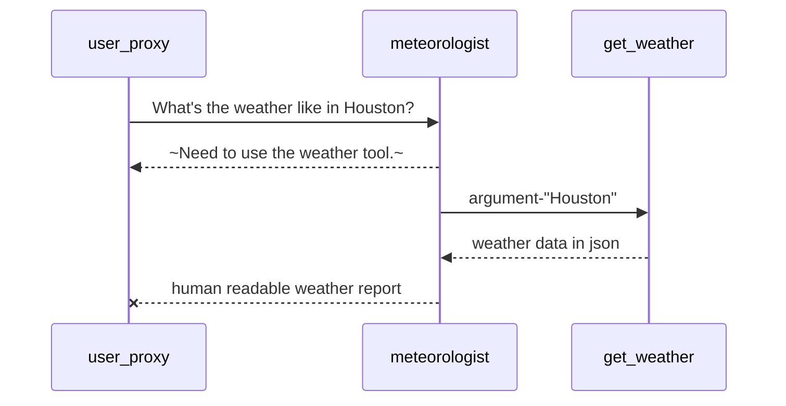

# Observation on 5a.weather-report

This app is based on <https://microsoft.github.io/autogen/0.2/docs/tutorial/tool-use>.

## Tool Use

1. This is another example of tool use, besides 5.calculator.
  a. This example has more worldly meaning. Yesterday several tornados swept across Houston and left a trail of damange.
  b. I compared the response from GPT4 with that Claude. The latter is better structured.
  c. Interestingly, when the tool returns an error, the LLM tries to put a nice spin for a better response, like a human admitting an error.
  d. Claude is more expensive than GPT4, but slower.
2. This example calls [OpenWeatherMap API](https://openweathermap.org/api) to retrieve the weather data.
  a. The unit is hard-coded.
  b. TODO: That should be obtained from either API or LLM.
  c. LLM serves as a data scraper. If there was an API, that should provide more accurate and structured factual data.
  d. The business value of data scrapers is less development on both API producers and consumers.
3. This example is also a rewrite of another example [weather-agent](https://github.com/jaredlang/weather-agent), which was written in Feb-2024 with LangChain Agent model.
  a. AutoGen is easier to understand and has excellent documentation.
  b. LangChain feels weird and unnatural. When someone writing the code on his new year's holidays feels that way, imagine how non-developers would feel.

## Calling Sequence



## GPT4 and Claude Outputs

> Input to LLM (output from the get_weather Tool)
```
{"city": "Houston", "country_code": "US", "summary": "Mist", "description": "mist", "temp": 56, "feels_like": 55, "temp_max": 57, "temp_min": 53, "humidity": 92, "visibility": 2816, "wind_speed": 5}
```

> GPT4's Response
>> In Houston, the weather is currently misty. The temperature is 56°F, but it feels slightly cooler at 55°F. There is a high humidity level at 92%, which contributes to the misty conditions and reduced visibility of about 2816 meters. The wind is gentle, blowing at a speed of 5 mph. Temperatures today range between a low of 53°F and a high of 57°F.

> Claude's Response
>> As a meteorologist, I'm happy to provide you with the current weather conditions in Houston. Based on the data I've received:
>>  1. Temperature: The current temperature in Houston is 56°F (13°C). The temperature range for today is between 53°F (12°C) and 57°F (14°C). However, due to the humidity, it feels slightly cooler at about 55°F (13°C).
>>  2. Humidity: The humidity level is quite high at 92%. This high humidity is contributing to the current weather conditions.
>>  3. Visibility: Visibility is reduced to about 2,816 meters (approximately 1.75 miles), which is less than optimal.
>>  4. Wind: There's a light breeze with wind speeds around 5 mph (8 km/h).
>>  5. Overall conditions: The predominant weather condition right now is mist. This means there's a thin layer of tiny water droplets suspended in the air near the Earth's surface, reducing visibility.
>> In summary, Houston is experiencing a cool, damp, and misty day. The high humidity combined with the cool temperatures is creating misty conditions, which are reducing visibility. It's the kind of weather where you might want to wear layers and perhaps carry an umbrella or light raincoat, as mist can accumulate on clothing over time. If you're driving, remember to use your low beam headlights due to the reduced visibility. Stay safe and dry!

## Several Error Responses

> Error from The Tool
>> Error: module 'math' has no attribute 'max'

> GPT4 Response
>> It seems there is a technical issue retrieving the current weather information for Houston at the moment. However, I can provide a general description of Houston's weather patterns if that would be helpful.
