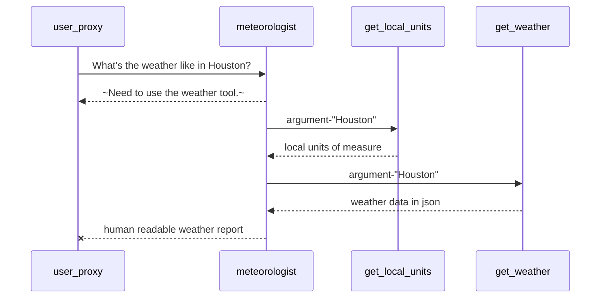

# Observations on 5b.weather-report-group

I invited an expert of measurement (metrologist) into the chat. He is going to tell us what the local units of measure are in a given location. 

## Conversation Sequence

